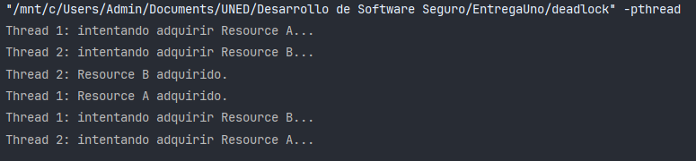

# Desarrollo de Software Seguro: Análisis de Vulnerabilidades


- [Desarrollo de Software Seguro: Análisis de Vulnerabilidades](#desarrollo-de-software-seguro-análisis-de-vulnerabilidades)
    - [Introducción](#introducción)
    - [Fundamentos Teóricos](#fundamentos-teóricos)
      - [Software Seguro y Resiliente](#software-seguro-y-resiliente)
      - [Errores Más Comunes](#errores-más-comunes)
    - [Desarrollo](#desarrollo)
      - [1. Input Validation and Representation](#1-input-validation-and-representation)
        - [Problemas Seleccionados](#problemas-seleccionados)
        - [Comparativa de Resultados](#comparativa-de-resultados)
      - [2. API Abuse](#2-api-abuse)
        - [Problemas Seleccionados](#problemas-seleccionados-1)
        - [Comparativa de Resultados](#comparativa-de-resultados-1)
  - [](#)
      - [3. Security Features](#3-security-features)
        - [Problemas Seleccionados](#problemas-seleccionados-2)
        - [Comparativa de Resultados](#comparativa-de-resultados-2)
      - [4. Time and State](#4-time-and-state)
        - [Problemas Seleccionados](#problemas-seleccionados-3)
        - [Comparativa de Resultados](#comparativa-de-resultados-3)
      - [5. Errors](#5-errors)
        - [Problemas Seleccionados](#problemas-seleccionados-4)
        - [Comparativa de Resultados](#comparativa-de-resultados-4)
      - [6. Code Quality](#6-code-quality)
        - [Problemas Seleccionados](#problemas-seleccionados-5)
        - [Ejecución y Análisis](#ejecución-y-análisis)
        - [Comparativa de Resultados](#comparativa-de-resultados-5)
      - [7. Encapsulation](#7-encapsulation)
        - [Problemas Seleccionados](#problemas-seleccionados-6)
        - [Comparativa de Resultados](#comparativa-de-resultados-6)
    - [Reflexiones y Conclusiones](#reflexiones-y-conclusiones)
    - [Bibliografía](#bibliografía)


### Introducción

El desarrollo de software seguro es una disciplina esencial en la ingeniería de software moderna, especialmente en un
contexto donde las aplicaciones están cada vez más expuestas a entornos diversos y potencialmente hostiles. Este trabajo
tiene como objetivo principal analizar y comprender cómo se manifiestan las vulnerabilidades en el software, así como
las protecciones inherentes que ofrecen los lenguajes de programación y entornos de desarrollo modernos.

A partir del estudio de los primeros temas de la asignatura y de referencias clave como "Seven Pernicious Kingdoms" y el
CWE/SANS Top 25, se ha decidido enfocar este proyecto en la exploración práctica de varias vulnerabilidades comunes,
como el desbordamiento de buffer, la inyección SQL y el Cross-Site Scripting (XSS). Estas vulnerabilidades han sido
seleccionadas por su relevancia en el ámbito de la seguridad de software y por su representatividad dentro de distintas
categorías de errores de programación.

El enfoque del trabajo no se centra en la funcionalidad de los programas desarrollados, sino en su capacidad para
ilustrar y probar las vulnerabilidades seleccionadas. De este modo, se busca identificar las debilidades inherentes en
los lenguajes y entornos elegidos, así como las medidas preventivas que estos ofrecen. La investigación también incluirá
casos en los que las vulnerabilidades no puedan ser reproducidas debido a protecciones existentes, lo que también será
objeto de análisis.

Con esta metodología, el trabajo pretende proporcionar un aprendizaje práctico y aplicado sobre las mejores prácticas en
el desarrollo de software seguro, ayudando a prevenir errores comunes y a diseñar aplicaciones resilientes ante ataques
y usos indebidos.

### Fundamentos Teóricos

#### Software Seguro y Resiliente

Un software seguro y resiliente se caracteriza por su capacidad para proteger la información y los recursos frente a
accesos no autorizados, ataques malintencionados y errores involuntarios. Entre sus propiedades fundamentales destacan:

- **Confidencialidad**: Garantiza que la información está disponible solo para las personas autorizadas.
- **Integridad**: Protege la información contra modificaciones no autorizadas.
- **Disponibilidad**: Asegura que los recursos estén accesibles cuando se necesitan.
- **Autenticación**: Verifica la identidad de los usuarios y sistemas.
- **Autorización**: Controla el acceso a recursos en función de permisos predefinidos.
- **Auditoría**: Registra y monitorea las acciones para identificar actividades sospechosas.

#### Errores Más Comunes

Los errores más peligrosos según el **CWE/SANS Top 25** incluyen vulnerabilidades que suelen ser explotadas en
aplicaciones modernas. Para 2024, de acuerdo con [MITRE](https://www.mitre.org/), el ranking de los mismos es el
siguiente:

**¿Qué es MITRE?**

MITRE es una organización sin ánimo de lucro que gestiona programas de investigación y desarrollo para el beneficio
público, particularmente en áreas como ciberseguridad, defensa, salud pública y tecnologías emergentes. Entre sus
contribuciones destaca la gestión de bases de datos como CWE (Common Weakness Enumeration) y CVE (Common Vulnerabilities
and Exposures), herramientas fundamentales para identificar, clasificar y mitigar vulnerabilidades en el desarrollo de
software.

<div align="center">
    
    <p><em>Figura 1: Logo de MITRE</em></p>
</div>

A continuación, se presenta una tabla con el ranking de vulnerabilidades, de las cuales, aquellas marcadas con un asterisco
(*) en el ID son para las que se han desarrollado también ejemplos prácticos en este trabajo.

| **Rank** | **ID**   | **Name**                                                                                   | **Score** | **CVEs in KEV** | **Rank Change vs. 2023** |
|----------|----------|--------------------------------------------------------------------------------------------|-----------|-----------------|--------------------------|
| 1        | CWE-79   | Improper Neutralization of Input During Web Page Generation ('Cross-site Scripting')       | 56.92     | 3               | +1                       |
| 2        | CWE-787  | Out-of-bounds Write                                                                        | 45.20     | 18              | -1                       |
| 3        | CWE-89   | Improper Neutralization of Special Elements used in an SQL Command ('SQL Injection')       | 35.88     | 4               | 0                        |
| 4        | CWE-352  | Cross-Site Request Forgery (CSRF)                                                          | 19.57     | 0               | +5                       |
| 5        | CWE-22   | Improper Limitation of a Pathname to a Restricted Directory ('Path Traversal')             | 12.74     | 4               | +3                       |
| 6        | CWE-125  | Out-of-bounds Read                                                                         | 11.42     | 3               | +1                       |
| 7        | CWE-78   | Improper Neutralization of Special Elements used in an OS Command ('OS Command Injection') | 11.30     | 5               | -2                       |
| **8**        | **CWE-416\*** | **Use After Free**                                                                             | 10.19     | 5               | -4                       |
| 9        | CWE-862  | Missing Authorization                                                                      | 10.11     | 0               | +2                       |
| 10       | CWE-434  | Unrestricted Upload of File with Dangerous Type                                            | 10.03     | 0               | 0                        |
| 11       | CWE-94   | Improper Control of Generation of Code ('Code Injection')                                  | 7.13      | 7               | +12                      |
| **12**       | **CWE-20\***  | **Improper Input Validation**                                                                  | 6.78      | 1               | -6                       |
| 13       | CWE-77   | Improper Neutralization of Special Elements used in a Command ('Command Injection')        | 6.74      | 4               | +3                       |
| 14       | CWE-287  | Improper Authentication                                                                    | 5.94      | 4               | -1                       |
| 15       | CWE-269  | Improper Privilege Management                                                              | 5.22      | 0               | +7                       |
| 16       | CWE-502  | Deserialization of Untrusted Data                                                          | 5.07      | 5               | -1                       |
| 17       | CWE-200  | Exposure of Sensitive Information to an Unauthorized Actor                                 | 5.07      | 0               | +13                      |
| 18       | CWE-863  | Incorrect Authorization                                                                    | 4.05      | 2               | +6                       |
| 19       | CWE-918  | Server-Side Request Forgery (SSRF)                                                         | 4.05      | 2               | 0                        |
| 20       | CWE-119  | Improper Restriction of Operations within the Bounds of a Memory Buffer                    | 3.69      | 2               | -3                       |
| **21**       | **CWE-476\*** | **NULL Pointer Dereference**                                                                   | 3.58      | 0               | -9                       |
| **22**       | **CWE-798\*** | **Use of Hard-coded Credentials**                                                              | 3.46      | 2               | -4                       |
| **23**       | **CWE-190\*** | **Integer Overflow or Wraparound**                                                            | 3.37      | 3               | -9                       |
| 24       | CWE-400  | Uncontrolled Resource Consumption                                                          | 3.23      | 0               | +13                      |
| 25       | CWE-306  | Missing Authentication for Critical Function                                               | 2.73      | 5               | -5                       |

Algunos ejemplos destacados son:

1. **CWE-79**: Cross-site Scripting (XSS): Neutralización inapropiada de entradas durante la generación de páginas web.
2. **CWE-787**: Escritura fuera de los límites de memoria.
3. **CWE-89**: Inyección SQL: Neutralización incorrecta de elementos especiales en comandos SQL.
4. **CWE-352**: Cross-Site Request Forgery (CSRF): Peticiones no autorizadas realizadas desde un navegador autenticado.
5. **CWE-22**: Path Traversal: Limitación inadecuada de rutas de acceso.

Estos errores pertenecen a diferentes categorías de vulnerabilidades, como la validación de entradas, el manejo
incorrecto de memoria y el abuso de APIs, que se analizan también en los "Seven Pernicious Kingdoms".

### Desarrollo

El "Seven Pernicious Kingdoms" clasifica los errores de seguridad del software en siete categorías principales y una
categoría adicional para problemas de configuración. Cada "reino" o categoría abarca distintos tipos de vulnerabilidades
que afectan la calidad y seguridad del software. En esta sección, se incluyen ejemplos específicos de cada una de estas
categorías que ilustran vulnerabilidades de entrada, representación, y otras, demostrando cómo se manifiestan en
entornos reales.

#### 1. Input Validation and Representation

A continuación, se han seleccionado algunos ejemplos correspondientes al primer reino **Input Validation and
Representation**, que incluye errores derivados de confiar en entradas no validadas y representaciones inapropiadas.

##### Problemas Seleccionados


1. **Desbordamiento de Buffer**
    - **Vulnerabilidad**: Falta de verificación de límites al trabajar con memoria.
    - **Descripción**: Este ejemplo demuestra cómo un desbordamiento de buffer puede corromper datos o permitir la ejecución de código malicioso.
    - **Lenguaje**: C
    - **Ubicación del Ejemplo**: [examples/1_input_representation_and_validation/buffer_overflow/](https://github.com/antonioap101/Desarrollo_De_Software_Seguro_Entrega_Uno/tree/main/examples/1_input_representation_and_validation/buffer_overflow/)
---

2. **SQL Injection**
    - **Vulnerabilidad**: La construcción de sentencias SQL dinámicas con entradas no validadas permite a un atacante modificar el significado de la consulta o ejecutar comandos arbitrarios.
    - **Descripción**: Este ejemplo compara el uso de una consulta SQL dinámica insegura frente a un enfoque seguro utilizando consultas preparadas con parámetros.
    - **Lenguaje**: Python
    - **Ubicación del Ejemplo**: [examples/1_input_representation_and_validation/sql_injection/](https://github.com/antonioap101/Desarrollo_De_Software_Seguro_Entrega_Uno/tree/main/examples/1_input_representation_and_validation/sql_injection/)


##### Comparativa de Resultados

1. **Desbordamiento de Buffer**:
   - **Resultados con Protecciones Activas**: Cuando la entrada excede el tamaño del buffer (10 bytes), se produce un desbordamiento que desencadena un error de "stack smashing" detectado por las protecciones del compilador. Esto evidencia cómo un atacante podría explotar esta vulnerabilidad en sistemas sin protecciones adecuadas.

  <div align="center">
      
      <p><em>Figura 2: Ejecución del código mostrando el error de "stack smashing".</em></p>
  </div>

   - **Resultados sin Protecciones Activas**: Al compilar el programa desactivando las protecciones del compilador con el comando `gcc -fno-stack-protector -o buffer_overflow buffer_overflow.c`, el comportamiento cambia. Aunque el programa no detecta el "stack smashing", un desbordamiento significativo puede provocar un error de segmentación, como se observa en la siguiente salida:

  <div align="center">
      
      <p><em>Figura 3: Ejecución del código sin protecciones mostrando un error de segmentación.</em></p>
  </div>

2. **SQL Injection**:
    - **Consulta Insegura**:
        - Las entradas del usuario sin validar se insertan directamente en una consulta SQL dinámica.
        - Un atacante puede ejecutar comandos SQL arbitrarios, accediendo o modificando información sensible.
    - **Consulta Segura**:
        - Utilizar consultas preparadas con parámetros evita la ejecución de entradas maliciosas, protegiendo la base de datos frente a inyecciones SQL.
    - **Resultados Destacados**:
        - Un atacante que intente ejecutar `admin'--` en una consulta insegura obtendrá acceso indebido al sistema.
        - En la consulta segura, la entrada es tratada como texto literal, evitando la ejecución maliciosa.

  <div align="center">
      
      <p><em>Figura 4: Ejemplo de SQL Injection, destacando la isportancia de consultas con validación adecuada de la entrada del usuario.</em></p>
  </div>


Esto demuestra que, sin las protecciones activas, el desbordamiento puede generar comportamientos impredecibles o
provocar el crasheo de la aplicación.

#### 2. API Abuse

**API Abuse** se refiere al mal uso de una API, que actúa como un contrato entre el consumidor (caller) y el proveedor (
callee). Este tipo de vulnerabilidades ocurre cuando una de las partes no cumple su rol, lo que puede resultar en un
comportamiento inesperado, inseguro o en datos incorrectos.

En esta sección, se presentan ejemplos que ilustran cómo prácticas como **Unchecked Return Value** y **Often Misused:
Exception Handling** pueden comprometer la seguridad y funcionalidad de un programa.

---

##### Problemas Seleccionados

1. **Unchecked Return Value**
    - **Vulnerabilidad**: Ignorar los valores de retorno al utilizar una API puede llevar a estados inconsistentes o pérdida de control del flujo del programa.
    - **Descripción**: Este ejemplo muestra cómo ignorar un valor de retorno puede causar un fallo crítico, como intentar operar sobre un recurso no disponible.
    - **Lenguaje**: Java
    - **Ubicación del Ejemplo**: [examples/2_api_abuse/unchecked_return_value_java/](https://github.com/antonioap101/Desarrollo_De_Software_Seguro_Entrega_Uno/tree/main/examples/2_api_abuse/unchecked_return_value_java/)

2. **Often Misused: Exception Handling**
    - **Vulnerabilidad**: Manejar incorrectamente las excepciones puede llevar a comportamientos inesperados o inseguridades en el programa.
    - **Descripción**: Este ejemplo demuestra cómo un manejo inadecuado de excepciones, como capturar excepciones genéricas o no manejar errores específicos, puede provocar comportamientos erráticos.
    - **Lenguaje**: Python
    - **Ubicación del Ejemplo**: [examples/2_api_abuse/misused_exception_handling_python/](https://github.com/antonioap101/Desarrollo_De_Software_Seguro_Entrega_Uno/tree/main/examples/2_api_abuse/misused_exception_handling_python/)

---

##### Comparativa de Resultados

1. **Unchecked Return Value**:
   <div align="center">
       
       <p><em>Figura 4: Ejemplo de vulnerabilidad al ignorar el valor de retorno en Java. Este comportamiento puede provocar estados inconsistentes en el sistema, fallos críticos y pérdida de control del flujo del programa.</em></p>
   </div>

2. **Often Misused: Exception Handling**:
   <div align="center">
       
       <p><em>Figura 5: Ejemplo de manejo incorrecto y adecuado de excepciones en Python. Capturar excepciones genéricas o no manejar errores específicos puede ocultar problemas críticos y llevar a comportamientos inesperados.</em></p>
   </div>
---


#### 3. Security Features

**Security Features** aborda errores relacionados con la autenticación, control de acceso y gestión de contraseñas. En esta sección, se ilustra la vulnerabilidad **Password Management: Hard-Coded Password** comparando un enfoque inseguro (contraseñas sin hashear) con uno seguro (contraseñas hasheadas).

##### Problemas Seleccionados

1. **Password Management: Hard-Coded Password (CWE-798)**
    - **Vulnerabilidad**: Contraseñas incrustadas directamente en el código fuente que pueden ser expuestas al público o reutilizadas indebidamente.
    - **Descripción**: Este ejemplo demuestra cómo el uso de contraseñas hard-coded puede comprometer la seguridad del sistema al hacerlas accesibles a cualquiera con acceso al código fuente.
    - **Lenguaje**: JavaScript
    - **Ubicación del Ejemplo**: [examples/3_security_features/hard_coded_password/](https://github.com/antonioap101/Desarrollo_De_Software_Seguro_Entrega_Uno/tree/main/examples/3_security_features/hard_coded_password/)

2. **Password Management: Storage**
    - **Vulnerabilidad**: Uso de contraseñas sin hashear que quedan expuestas a ataques.
    - **Descripción**: Este ejemplo implementa funciones para registrar, autenticar y eliminar usuarios, contrastando un sistema inseguro con uno seguro. Se presentan dos implementaciones: una insegura (almacenamiento en texto plano) y otra segura (almacenamiento hasheado con bcrypt).
    - **Lenguaje**: Python
    - **Ubicación del Ejemplo**: [examples/3_security_features/password_storage/](https://github.com/antonioap101/Desarrollo_De_Software_Seguro_Entrega_Uno/tree/main/examples/3_security_features/password_storage/)

---

##### Comparativa de Resultados

1. **Password Management: Hard-Coded Password**:
   <div align="center">
       
       
       
       <p><em>Figura 6: Ejemplos de vulnerabilidad causada por contraseñas hard-coded en JavaScript. Este comportamiento expone las contraseñas a cualquier usuario con acceso al código fuente, comprometiendo la seguridad del sistema.</em></p>
   </div>
   <div align="center">
       
       <p><em>Figura 7: Ejemplo adicional de vulnerabilidad causada por contraseñas hard-coded en Python. Este enfoque elimina la confidencialidad de las contraseñas, dejándolas expuestas a cualquier atacante con acceso al código.</em></p>
   </div>

2. **Password Management: Storage**:
   <div align="center">
       
       <p><em>Figura 8: Comparación entre almacenamiento seguro e inseguro de contraseñas. En el enfoque inseguro, las contraseñas se almacenan en texto plano, accesibles directamente. En el enfoque seguro, las contraseñas se almacenan en forma hasheada, protegiéndolas contra accesos no autorizados.</em></p>
   </div>

   - **Enfoque Inseguro**:
     - Las contraseñas se almacenan en texto plano en `db_users.json`.
     - Un atacante con acceso al archivo puede leerlas directamente.

   - **Enfoque Seguro**:
     - Las contraseñas se almacenan en forma hasheada usando `bcrypt`.
     - Un atacante no puede derivar la contraseña original del hash sin un ataque costoso.

--- 

#### 4. Time and State

**Time and State** se centra en errores derivados de la interacción entre procesos, hilos y el sistema operativo en entornos de computación distribuida o concurrente. Estos problemas suelen surgir debido a inconsistencias en el manejo del estado compartido o al tiempo de ejecución no controlado. Los defectos en esta categoría pueden causar fallos críticos, como bloqueos permanentes (deadlocks) o condiciones de carrera (race conditions), que afectan la disponibilidad y el correcto funcionamiento del sistema.

---


##### Problemas Seleccionados

1. **Deadlock**
   - **Vulnerabilidad**: Un deadlock ocurre cuando dos o más procesos o hilos esperan indefinidamente a que el otro libere un recurso, lo que detiene completamente la ejecución.
   - **Descripción**: Este ejemplo ilustra cómo el acceso inconsistente a recursos compartidos mediante bloqueos puede resultar en un deadlock. Se muestra un caso en el que dos hilos intentan adquirir recursos en un orden opuesto, bloqueándose mutuamente.
   - **Lenguajes**: Python, C
   - **Ubicación de los ejemplos**: [examples/4_time_and_state/deadlock/](https://github.com/antonioap101/Desarrollo_De_Software_Seguro_Entrega_Uno/tree/main/examples/4_time_and_state/deadlock/)

---

##### Comparativa de Resultados

1. **Sin Manejo de Deadlock**:
    - Los hilos intentan adquirir recursos en órdenes contradictorios, lo que lleva al bloqueo permanente.
    - El programa deja de responder y no completa su ejecución.

2. **Con Manejo de Deadlock**:
    - El uso de un orden consistente en la adquisición de recursos previene el bloqueo.
    - Los hilos completan su tarea sin interrupciones.

<div align="center">
    
    <p><em>Figura 9: Ejemplo de bloqueo mutuo entre dos hilos que resulta en un deadlock.</em></p>
</div>

Este ejemplo destaca la importancia de manejar correctamente los bloqueos en entornos concurrentes, especialmente en sistemas distribuidos o multi-hilo. Una planificación adecuada y el uso de herramientas como `timeout` o algoritmos de detección de deadlocks pueden ser posibles soluciones. 

---

#### 5. Errors

**Errors** abarca vulnerabilidades relacionadas con el manejo incorrecto de errores o la falta de manejo de los mismos. Este tipo de vulnerabilidades puede resultar en un comportamiento inesperado, pérdida de datos o incluso una brecha de seguridad al exponer información sensible.

En esta sección se aborda el impacto de ignorar o manejar incorrectamente los errores mediante el ejemplo **Empty Catch Block**, que ilustra cómo la ausencia de una gestión adecuada de excepciones puede llevar a resultados impredecibles o difíciles de rastrear.

---

##### Problemas Seleccionados
1. **Empty Catch Block**
- **Vulnerabilidad**: Ignorar excepciones o errores, lo que permite que el programa continúe en un estado potencialmente inseguro o con información incorrecta.
- **Descripción**: Este ejemplo compara un manejo inadecuado de excepciones (bloques de captura vacíos) con una gestión robusta, que registra errores y permite la recuperación o el cierre seguro de recursos.
- **Lenguaje**: Python 
- **Ubicación de los ejemplos**: [examples/5_errors/empty_catch_block/](https://github.com/antonioap101/Desarrollo_De_Software_Seguro_Entrega_Uno/tree/main/examples/5_errors/empty_catch_block/)  

---

##### Comparativa de Resultados

1. **Enfoque Inseguro**:
   - Excepciones ignoradas en un bloque de captura vacío.
   - El programa continúa ejecutándose sin conocer el error.
   - Potencial para datos corruptos, pérdida de información o estados inconsistentes.

2. **Enfoque Seguro**:
   - Las excepciones se registran y gestionan de manera explícita.
   - La ejecución puede ser detenida o redirigida a una ruta alternativa para mitigar el problema.
   - Uso de mensajes de registro para ayudar a la depuración.

<div align="center">
    
    <p><em>Figura 10: Comparación entre el manejo seguro e inseguro de excepciones en Python.</em></p>
</div>

---

En el caso inseguro, el error puede es silenciado completamente, dejando al programa en un estado incierto y sin información útil para los desarrolladores. En el caso seguro, se asegura que todos los errores se gestionen o registren para mitigar su impacto. 


#### 6. Code Quality

**Code Quality** se refiere a prácticas de desarrollo deficientes que pueden derivar en comportamientos impredecibles y vulnerabilidades de seguridad. Desde un punto de vista del usuario, esto podría manifestarse como errores o fallos inesperados. Sin embargo, para un atacante, estas deficiencias representan oportunidades para explotar el sistema, desencadenando fallos más graves como corrupción de memoria, fugas de información, o incluso la ejecución de código malicioso.

En esta sección, se abordan cinco ejemplos clásicos de problemas relacionados con la calidad del código:

---

##### Problemas Seleccionados

1. **Double Free**
   - **Descripción**: Liberar dos veces un mismo bloque de memoria puede causar corrupción de memoria, lo que puede ser aprovechado para desbordar buffers u otros ataques.
   - **Lenguaje**: C
   - **Ubicación del Ejemplo**: [examples/6_code_quality/double_free/](https://github.com/antonioap101/Desarrollo_De_Software_Seguro_Entrega_Uno/tree/main/examples/6_code_quality/double_free/)

<div align="center">
    
    <p><em>Figura 11: Ejecución del ejemplo de Double Free en C, mostrando el mensaje de error debido al intento de liberar memoria ya liberada.</em></p>
</div>

---

2. **Memory Leak**
   - **Descripción**: La memoria asignada y nunca liberada puede agotar los recursos del sistema, ralentizando o bloqueando aplicaciones críticas.
   - **Lenguaje**: C++
   - **Ubicación del Ejemplo**: [examples/6_code_quality/memory_leak/](https://github.com/antonioap101/Desarrollo_De_Software_Seguro_Entrega_Uno/tree/main/examples/6_code_quality/memory_leak/)

<div align="center">
   
   <p><em>Figura 12: Resultado de la ejecución con Valgrind. Se observa que 40 bytes de memoria han quedado sin liberar 
("definitely lost"), asignados en la función <code>memoryLeakExample</code>. Esto confirma la presencia de una fuga
de memoria debido a la falta de liberación explícita con <code>delete[]</code>.</em>
</p> 
</div>

---

3. **Null Dereference (CWE-476)**
   - **Descripción**: Intentar acceder a un puntero nulo puede provocar un fallo inmediato del programa.
   - **Lenguaje**: C++
   - **Ubicación del Ejemplo**: [examples/6_code_quality/null_dereference/](https://github.com/antonioap101/Desarrollo_De_Software_Seguro_Entrega_Uno/tree/main/examples/6_code_quality/null_dereference/)

<div align="center">
    
    <p><em>Figura 13: Ejecución del ejemplo de Null Dereference en C++, donde el intento de desreferenciar un puntero nulo resulta en un fallo de segmentación.</em></p>
</div>

---

4. **Use After Free (CWE-416)**
   - **Descripción**: Intentar acceder a memoria que ya ha sido liberada puede provocar comportamientos no definidos o permitir ataques maliciosos.
   - **Lenguaje**: C
   - **Ubicación del Ejemplo**: [examples/6_code_quality/use_after_free/](https://github.com/antonioap101/Desarrollo_De_Software_Seguro_Entrega_Uno/tree/main/examples/6_code_quality/use_after_free/)

<div align="center">
    
    <p><em>Figura 14: Ejecución del ejemplo de Use After Free en C, mostrando resultados impredecibles al intentar acceder a memoria liberada.</em></p>
</div>

---

5. **Uninitialized Variable**
   - **Descripción**: Usar una variable sin inicializar puede generar resultados impredecibles o fugas de información sensible.
   - **Lenguaje**: C
   - **Ubicación del Ejemplo**: [examples/6_code_quality/uninitialized_variable/](https://github.com/antonioap101/Desarrollo_De_Software_Seguro_Entrega_Uno/tree/main/examples/6_code_quality/uninitialized_variable/)

<div align="center">
    
    <p><em>Figura 15: Ejecución del ejemplo de Uninitialized Variable en C, donde se muestra un valor aleatorio impredecible.</em></p>
</div>

---

##### Ejecución y Análisis

Los ejemplos han sido diseñados para ejecutarse en entornos Linux con compiladores GCC o Clang. Cada ejemplo puede compilarse utilizando el comando:
```shell
gcc -o <output_file> <source_file.c> # Para C
g++ -o <output_file> <source_file.cpp> # Para C++
```

Para utilizar la herramienta valgrind, se puede ejecutar el siguiente comando:
```shell
valgrind --leak-check=full --show-leak-kinds=all ./<output_file>
```


##### Comparativa de Resultados

1. **Enfoque Inseguro**:
   - En cada caso, el programa demuestra cómo la mala calidad del código puede llevar a fallos críticos.
   - Los ejemplos inseguros permiten observar errores como fallos de segmentación (`segmentation fault`), fugas de memoria o comportamientos inesperados.

2. **Enfoque Seguro**:
   - Se presentan estrategias para prevenir estos errores, como:
     - Uso adecuado de funciones de liberación de memoria.
     - Inicialización explícita de variables.
     - Uso de punteros inteligentes en C++ para manejar memoria.

---

#### 7. Encapsulation

**Encapsulation** trata sobre establecer límites claros en el manejo y acceso de datos para evitar fugas de información, accesos indebidos y comportamientos inesperados. Este principio es fundamental para garantizar que cada componente de un sistema maneje únicamente los datos que necesita y de la manera esperada, protegiendo la privacidad y la seguridad de los usuarios.

Las vulnerabilidades en esta categoría surgen cuando se debilitan o eliminan estas barreras, lo que puede permitir ataques como la manipulación de datos entre usuarios, fugas de información sensible o la exposición de datos no validados.

---

##### Problemas Seleccionados

1. **Trust Boundary Violation**
   - **Vulnerabilidad**: Combinar datos confiables y no confiables en una misma estructura puede generar errores de validación, lo que permite que datos maliciosos se traten como válidos.
   - **Descripción**: Este ejemplo demuestra cómo la falta de separación entre datos validados y no validados puede comprometer la seguridad del sistema. Al no distinguir claramente entre ellos, se permite que datos no validados se usen en operaciones críticas.
   - **Lenguaje**: Java
   - **Ubicación del Ejemplo**: [examples/7_encapsulation/trust_boundary_violation/](https://github.com/antonioap101/Desarrollo_De_Software_Seguro_Entrega_Uno/tree/main/examples/7_encapsulation/trust_boundary_violation/)

2. **Private Array-Typed Field Returned From a Public Method**
   - **Vulnerabilidad**: Devolver un array privado como referencia desde un método público puede permitir modificaciones inesperadas del contenido privado desde fuera de la clase.
   - **Descripción**: Este ejemplo ilustra cómo devolver referencias directas a arrays privados puede comprometer la encapsulación de la clase, permitiendo a usuarios externos alterar su estado interno.
   - **Lenguaje**: C++
   - **Ubicación del Ejemplo**: [examples/7_encapsulation/private_array_returned/](https://github.com/antonioap101/Desarrollo_De_Software_Seguro_Entrega_Uno/tree/main/examples/7_encapsulation/private_array_returned/)

3. **Public Data Assigned to Private Array-Typed Field**
   - **Vulnerabilidad**: Asignar datos públicos a un array privado permite que los datos internos reflejen cambios en las variables externas, comprometiendo la privacidad de la información.
   - **Descripción**: Este ejemplo demuestra cómo la dependencia de datos públicos puede afectar directamente la privacidad y seguridad del estado interno de una clase, exponiéndola a manipulación no intencionada.
   - **Lenguaje**: C++
   - **Ubicación del Ejemplo**: [examples/7_encapsulation/public_data_assigned/](https://github.com/antonioap101/Desarrollo_De_Software_Seguro_Entrega_Uno/tree/main/examples/7_encapsulation/public_data_assigned/)

---

##### Comparativa de Resultados

1. **Trust Boundary Violation**:
   <div align="center">
       
       <p><em>Figura 16: Ejemplo de violación de límites de confianza en Java. Una combinación incorrecta de datos confiables y no confiables permite procesar entradas maliciosas, poniendo en riesgo la seguridad.</em></p>
   </div>
   - **Impacto**:
     - Los datos no validados ingresados por el usuario pueden ejecutarse como si fueran válidos.
     - Este comportamiento puede derivar en fugas de información o ataques como XSS o inyecciones.

2. **Private Array-Typed Field Returned From a Public Method**:
   <div align="center">
       
       <p><em>Figura 17: Ejemplo de retorno de un array privado que permite modificaciones inesperadas. Usuarios externos pueden alterar el contenido del array, comprometiendo la integridad de la clase.</em></p>
   </div>
   - **Impacto**:
     - Permitir referencias directas a arrays privados expone la encapsulación, permitiendo modificaciones no autorizadas al estado interno.

3. **Public Data Assigned to Private Array-Typed Field**:
   <div align="center">
       
       <p><em>Figura 18: Ejemplo de asignación de datos públicos a arrays privados, comprometiendo su privacidad. Este comportamiento debilita la encapsulación y la privacidad de los datos.</em></p>
   </div>
   - **Impacto**:
     - Asignar datos públicos a un array privado vincula directamente los datos externos con el estado interno de la clase.
     - Cambios en los datos externos reflejan modificaciones indeseadas en el array interno.


---


### Reflexiones y Conclusiones

El desarrollo de software seguro es un desafío complejo que combina conocimientos técnicos, buenas prácticas de diseño y una mentalidad orientada a la prevención de riesgos. Este trabajo ha permitido explorar de manera práctica cómo las vulnerabilidades pueden surgir en distintas etapas del ciclo de vida del software, afectando su calidad, seguridad y confiabilidad. A través de ejemplos específicos basados en la taxonomía de los "Seven Pernicious Kingdoms" y el **CWE/SANS Top 25**, se evidencia cómo pequeños descuidos en la validación de entradas, el manejo de recursos o la encapsulación pueden comprometer sistemas completos.

La validación de entradas destaca como una de las áreas más críticas, ya que errores como desbordamientos de buffer o inyecciones SQL no solo afectan la funcionalidad, sino que también representan riesgos serios de explotación. La incapacidad de manejar adecuadamente los datos provenientes de usuarios o sistemas externos subraya la necesidad de implementar principios sólidos de depuración y control.

Por otro lado, los problemas relacionados con el manejo de APIs, como valores de retorno ignorados o excepciones mal gestionadas, ponen de manifiesto la importancia de considerar las especificaciones y limitaciones de las herramientas que utilizamos. Estos errores, aparentemente menores, pueden derivar en estados inconsistentes o fallos críticos en aplicaciones que dependen de interacciones complejas entre componentes.

En el ámbito de la computación concurrente, los deadlocks y condiciones de carrera representan desafíos comunes aunque significativos, especialmente en sistemas distribuidos o con múltiples hilos de ejecución. Estos problemas evidencian la necesidad de un diseño cuidadoso y la adopción de patrones que garanticen el acceso seguro a los recursos compartidos. Asimismo, la gestión de memoria y recursos, como lo demuestran ejemplos de "memory leaks" y "use after free", resalta la importancia de adoptar prácticas modernas de programación y utilizar herramientas especializadas, como "Valgrind" para evitar errores recurrentes.

La encapsulación, como principio de diseño, se confirma como un elemento clave para proteger los límites de confianza en los sistemas. La exposición de datos privados o la mezcla de datos confiables y no confiables puede llevar a fugas de información, manipulaciones indebidas y otros problemas que comprometen la seguridad global de la aplicación.

En conclusión, este trabajo pone de manifiesto que el desarrollo de software seguro no es solo un objetivo técnico, sino también una responsabilidad fundamental en un entorno cada vez más interconectado y expuesto. Los estándares como **MITRE CWE** y **Seven Pernicious Kingdoms** ofrecen una base sólida para identificar y mitigar vulnerabilidades, mientras que las prácticas exploradas en este proyecto refuerzan la importancia de abordar la seguridad desde las primeras etapas del desarrollo. Más allá de prevenir errores, el desarrollo de software seguro busca garantizar sistemas resilientes y confiables que respondan a las expectativas de los usuarios y protejan la integridad de los datos en un mundo digital en constante evolución.

---

### Bibliografía

En esta sección se enumeran las referencias utilizadas para analizar las vulnerabilidades y conceptos tratados en el
trabajo:

1. **CWE/SANS Top 25**: Publicación oficial sobre los 25 errores de software más peligrosos.
    - Fuente: [CWE/SANS 2024 Top 25](https://cwe.mitre.org/top25/archive/2024/2024_cwe_top25.html#top25list)
    - Análisis general y puntuación de las vulnerabilidades.

2. **CCN-CERT**: Resumen sobre los CWE/SANS Top 25.
   - Fuente: [CCN-CERT sobre CWE/SANS](https://www.ccn-cert.cni.es/es/soluciones-seguridad/elena.html?view=article&id=895:cwesans-publica-la-lista-de-los-25-errores-de-software-mas-peligrosos&catid=23)

3. **Seven Pernicious Kingdoms**: Taxonomía de errores de seguridad en software.
   - Fuente: [Seven Pernicious Kingdoms: Taxonomy of Software Security Errors (PDF)](https://cwe.mitre.org/documents/sources/SevenPerniciousKingdoms.pdf)

4. **Documentaciones oficiales**:
    - **C++**: [Documentación oficial de C++](https://cplusplus.com/)
    - **Python**: [Documentación oficial de Python](https://docs.python.org/3/)
    - **JavaScript**: [MDN Web Docs para JavaScript](https://developer.mozilla.org/en-US/docs/Web/JavaScript)
    - **SQL**: [Documentación oficial de SQLite](https://www.sqlite.org/docs.html)

